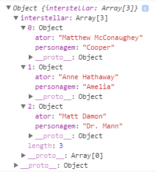

Hoje vamos conversar sobre os dois métodos oferecidos pelo Objeto JSON. Infelizmente, esse post não tem como objetivo ensinar o básico para quem nunca utilizou esse tipo de recurso, afinal, o intuito da série é falar sobre os métodos e propriedades oferecidos pela linguagem.

Porém, se você está começando e ainda sente dificuldades em criar/manipular um JSON, me avisa nos comentários que vou me organizar para fazer um post bem explicadinho sobre isso, ok?

`JSON.parse()` e `JSON.stringify()`.

### JSON.parse()

Usado para transformar uma **string em JSON**.

Passe como parâmetro a string que você deseja usar na conversão. É importante que essa string esteja formatada corretamente para gerar um JSON válido.


var elenco = '{"interstellar":[{"personagem":"Cooper","ator":"Matthew McConaughey"}\
,{"personagem":"Amelia","ator":"Anne Hathaway"}\
,{"personagem":"Dr. Mann","ator":"Matt Damon"}]}';

// Transformando: string -> JSON
var foo = JSON.parse(elenco);

console.log(foo);


O resultado disso será um objeto completamente pronto para ser manipulado, como podemos ver na imagem:

### JSON.stringify()

Usado para transformar um **JSON em string**.

Semelhante ao método anterior, passe como parâmetro um JSON válido para ser convertido.


var elenco = {
    "interstellar": [{
        "personagem": "Cooper",
        "ator": "Matthew McConaughey"
    }, {
        "personagem": "Amelia",
        "ator": "Anne Hathaway"
    }, {
        "personagem": "Dr. Mann",
        "ator": "Matt Damon"
    }]
};

// Transformando: JSON -> string
var foo = JSON.stringify(elenco);

console.log(foo);
> '{"interstellar":[{"personagem":"Cooper","ator":"Matthew McConaughey"}\
,{"personagem":"Amelia","ator":"Anne Hathaway"},{"personagem":"Dr. Mann","ator":"Matt Damon"}]}'


---

> _Esse post faz parte de uma série. Quer ver as outras postagens? [Clique aqui]()._